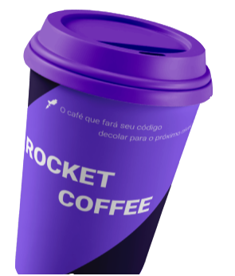

<div align="center">
  
</div>
<h1 align="center">
  <strong></strong>
</h1>

<p align="center">
🗣👥 Aceitei o desafio e ..., Desafio concluído com sucesso!!
</p>

# About

<p> 
    Iniciei o desafio lendo todas as instruções preescritas no site da rocketseat, em seguida iniciar um app com create next-app e por ser um desafio também resolvi me desafiar, instalei a lib Stitches, css-in-js, nunc tinha usado essa lib, mas tenho conhecimento pois ja dava uso de outra lib com msm fundamento, a Styled-components.
 
#### O que eu aprendi com esse desafio ?

Para criação da landing page adotei método **_Mobile First_**, criando toda interface pensando primeiramento como ela ia se comportar em dispositivos com a menor resolução.

Colocando em prática todo meu conhecimento de React e CSS, me capacitei ainda mais colocando em prática criação de um HTML semântico e visando a acessibilidade, responsividade da página e uso de uma nova ferramenta para dar estilos a minha página.

</p>

## 🧰 Tools

- [NextJS](https://nextjs.org)
- [Stiches CCS-IN-JS](https://stitches.dev)

## 🚧 Installation

```sh
  $ yarn

  $ yarn dev
```

## 🙅🏽‍♂️ Author

- **João Vitor** - [Joaobr200](https://github.com/joaobr200)
