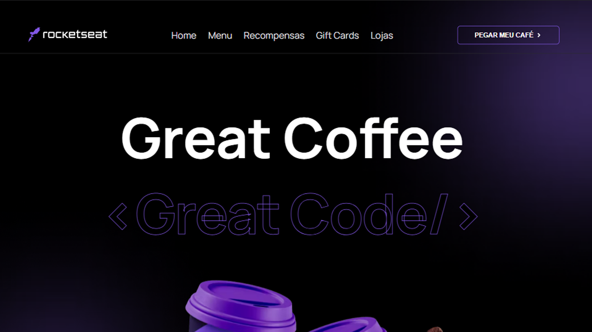
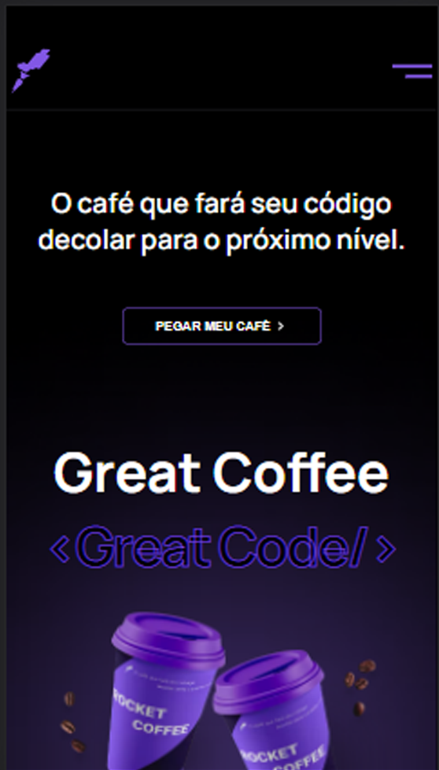

<div align="center">
  
</div>
<h1 align="center">
  <strong></strong>
</h1>

<p align="center">
🗣👥 Aceitei o desafie e ..., Desafio concluído com sucesso!!
</p>

## 🎨 Screen

<div align="LEFT">
  
</div>

<div align="RIGHT">
  
</div>

## 🧰 Tools

- [NextJS](https://nextjs.org)
- [Stiches CCS-IN-JS](https://stitches.dev)

## 🚧 Installation

```sh
  $ yarn

  $ yarn dev
```

## 🙅🏽‍♂️ Author

- **João Vitor** - [Joaobr200](https://github.com/joaobr200)
